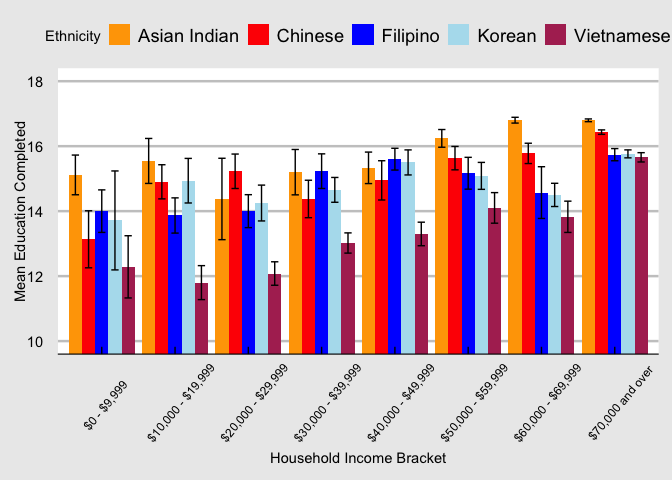
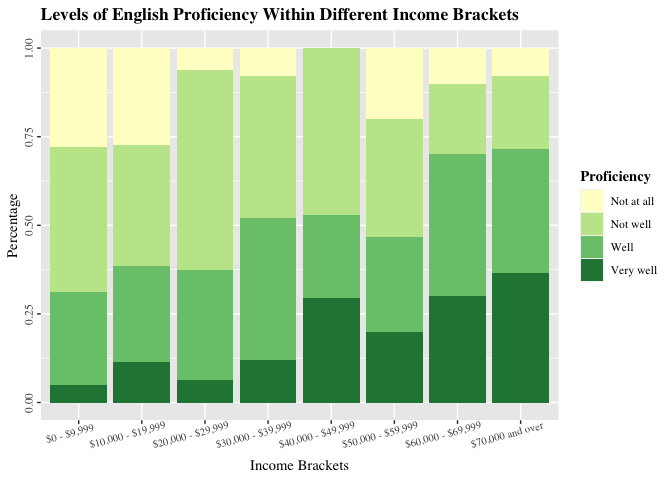
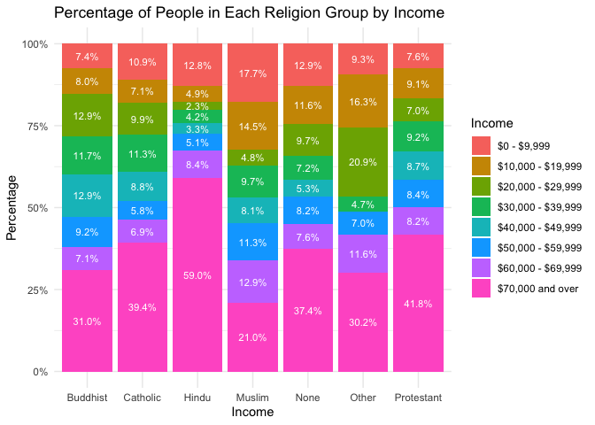

Asian American Quality of Life Project
================

# Links

- [Dataset
  Source](https://data.austintexas.gov/dataset/Final-Report-of-the-Asian-American-Quality-of-Life/hc5t-p62z)

# Project Overview

In this project, we study the impact of cultural differences on economic
well-being in the Asian American population within the Austin area. Our
objective is to answer the question: do cultural factors affect economic
outcomes such as income bracket, employment rate, or quality of life
among Asian Americans? We aim to determine how these variables influence
each other and to uncover the underlying mechanisms that contribute to
economic disparities within the Asian American population. By examining
factors, such as ethnicity, education, religion, and belonging, we
aspire to discern their interconnectedness with the economic success
indicators mentioned.

The dataset we are examining contains survey data on the fastest-growing
minority group in the United States, Asian Americans. Within this
dataset, the broad term includes individuals with origins in the Far
East, Southeast Asia, or the Indian subcontinent. The Final Report of
the Asian American Quality of Life (AAQoL) comes from a survey completed
by the city of Austin, TX from August 19 to December 12, 2015 (Jang
2016, 12). It includes 2,609 observations each corresponding to an
individual survey. There are 231 columns in the dataset, each
representing the various questions respondents were asked to fill out
when taking the survey.

# Hypothesis 1: Income Bracket v.s. Education vs. Ethnicity

We predict a variation in educational attainment amongst the different
types of Asian ethnicities. We also expect to see a positive general
relationship between education and income.

<!-- -->

# Hypothesis 2: Income Bracket v.s. English Proficiency

We predict that the level of English proficiency in the Asian American
population will be positively related with their income bracket.

<!-- -->

# Hypothesis 3: Income Bracket v.s. Religion

We predict that income brackets will vary based on religion and that
individuals identifying as Hindu have the highest percentage of top
earners on average.

<!-- -->

# Hypothesis 4: Employment Status v.s. Sense of Belonging

We predict that those who are employed full-time will have greater
levels of belonging and those who are unemployed will have lower levels
of belonging.

<!-- -->
